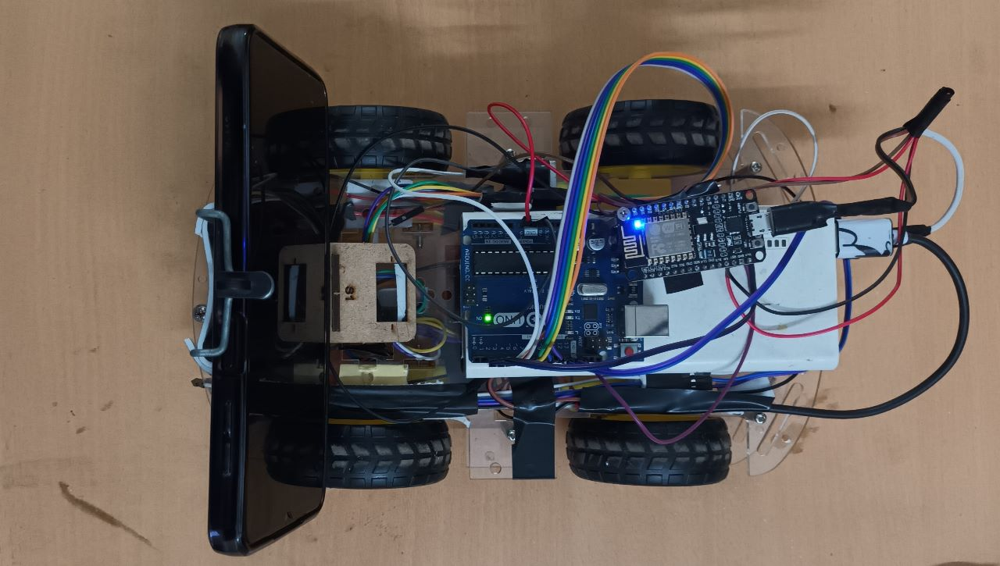

# Object Following Robot Project
[**Link to Robot in Action**](https://drive.google.com/file/d/1mn1hODnlCbF6M08VOaH5GQYa4s3tzvXw/view?usp=sharing)

## Overview

This project features an Object Following Robot that utilizes **OpenCV** and **NodeMCU**. The robot is capable of tracking and following a target it has been trained for. 
Image processing is performed on a laptop, and the results are transmitted to NodeMCU via the Python `requests` library over WiFi.
The implementation includes a multithreading algorithm to ensure efficient and responsive robot behavior. The robot is equipped with a smartphone camera to capture video frames.

## Features

- **Object Tracking:** Uses OpenCV for real-time object tracking.
- **WiFi Communication:** Transmits image processing results to NodeMCU over WiFi.
- **Multithreading:** Implements a multithreading algorithm for improved performance.
- **Smartphone Camera:** Utilizes a smartphone camera for capturing video frames.

## Hardware Setup

- **NodeMCU Microcontroller**
- **Smartphone with Camera**
- **Motorized Robot Chassis**
- **Laptop for Image Processing**

## Software Dependencies

- **OpenCV**
- **NodeMCU Firmware**
- **Python `requests` library**

